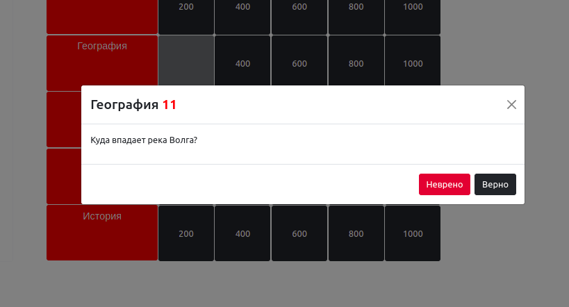

# YourGame
Игра с ведущим, вопросы из разных категорий

## Cтек:

+ **Фронтенд:** React, Redux(thunk), Axios, Bootstrap
+ **Бэкенд:** Node.js, Express, Sessions, PostgreSQL, Sequelize

***
Возможность играть есть только у зарегистрированных пользователей

***
Время ответов ограничено

***
Ведётся счёт очков, за неправильные ответы очки отнимаются

***
После окончания игры можно посмотреть рейтинг лучших игроков

***
В личном кабинете также будет отображена информация о прошедшей игре

